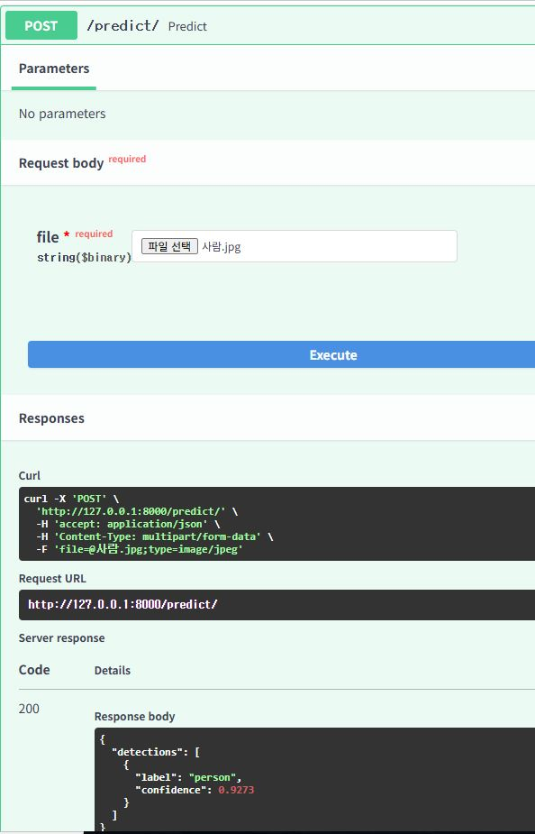

# YOLOv8 객체 탐지 Minimal Pipeline

FastAPI 서버를 통해 YOLOv8 모델 학습 및 추론을 구현한 간단한 End-to-End 파이프라인입니다.  
Docker로 컨테이너화하여 쉽게 배포할 수 있습니다.

---

## 📦 프로젝트 구조

```
C:\Users\MAIN\Workplace\CV\yolo8_pipline\
├── app.py                  # FastAPI 추론 서버
├── config.yaml              # 학습 설정 파일
├── Dockerfile               # Docker 빌드 파일
├── docker-compose.yml       # Docker Compose 설정
├── requirements.txt         # Python 의존성 파일
├── run.sh                   # 학습 및 서버 실행 스크립트
├── train.py                 # YOLOv8 학습 스크립트
```

---

## ⚙️ 사전 준비

- Python 3.10 이상
- Docker 설치

---

## 🛠️ 사용 방법

### 1. 로컬 개발 환경 (학습 + 서버 실행)

```bash
# 라이브러리 설치
pip install -r requirements.txt

# 모델 학습
python train.py --config config.yaml

# FastAPI 서버 실행
uvicorn app:app --reload
```

또는, 스크립트로 한 번에 실행할 수 있습니다.

```bash
bash run.sh
```

---

### 2. Docker 환경 실행

```bash
# Docker 빌드 및 컨테이너 실행
docker-compose up --build
```

API 서버 접속:  
`http://localhost:8000/predict/`

---

## 🚀 API 사용 방법

### Endpoint

| Method | URL          | 설명                  |
|:------:|:------------:|:---------------------:|
| POST   | `/predict/`  | 이미지 업로드 후 객체 탐지 결과 반환 |

### cURL 예시

```bash
curl -X POST "http://localhost:8000/predict/" -F "file=@your_image.jpg"
```

---

## 🔥 기술 스택

- Python 3.10
- Ultralytics YOLOv8
- FastAPI
- Docker / Docker Compose

---

## 📝 참고 사항

- 기본 데이터셋은 `coco128.yaml`로 설정되어 있습니다.
- `config.yaml` 파일을 수정하여 학습 파라미터를 조정할 수 있습니다.
- 학습 완료 후 모델 가중치는 `runs/detect/train/weights/best.pt` 경로에 저장됩니다.
- 별도 학습 없이 서버를 실행할 경우, 사전에 `best.pt` 파일이 존재해야 합니다.

---

## 📬 결과물

### 예시 이미지 및 결과



#### 탐지 결과


---
## 🚧 향후 개선 예정

현재는 FastAPI 서버가 직접 YOLOv8 모델을 호출하는 구조이지만,  
추후에는 **모델 서버와 백엔드 서버를 완전히 분리**하여 아키텍처를 개선할 예정입니다.

- 모델 서버 (예: Triton Inference Server, TorchServe 또는 FastAPI 기반 YOLO 서버)
  - YOLO 모델 추론 전용
- FastAPI 서버
  - 사용자의 요청을 받아 모델 서버에 Inference 요청

이를 통해 다음과 같은 효과를 기대합니다:
- **확장성 향상**: 여러 FastAPI 서버가 하나의 모델 서버를 공유
- **유지보수 용이성**: 모델 업데이트 시 백엔드 서버 수정 불필요
- **유연한 배포**: 모델 서버와 백엔드 서버를 독립적으로 배포 및 스케일링 가능

개선된 구조에서는 Docker Compose를 활용하여  
`model_server`와 `fastapi_server` 두 개의 서비스를 독립적으로 관리할 예정입니다.

---